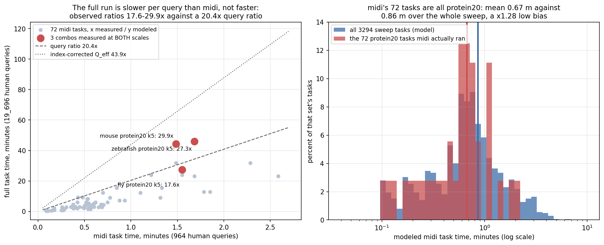
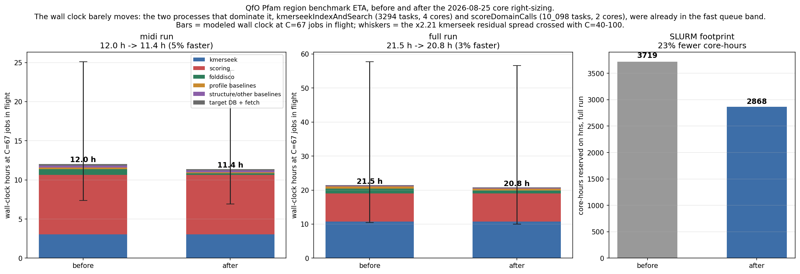
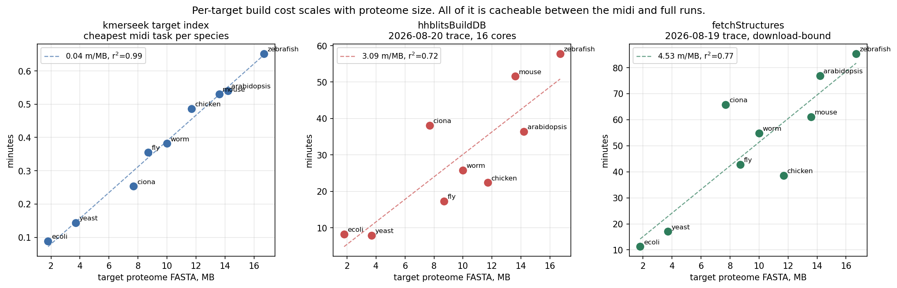
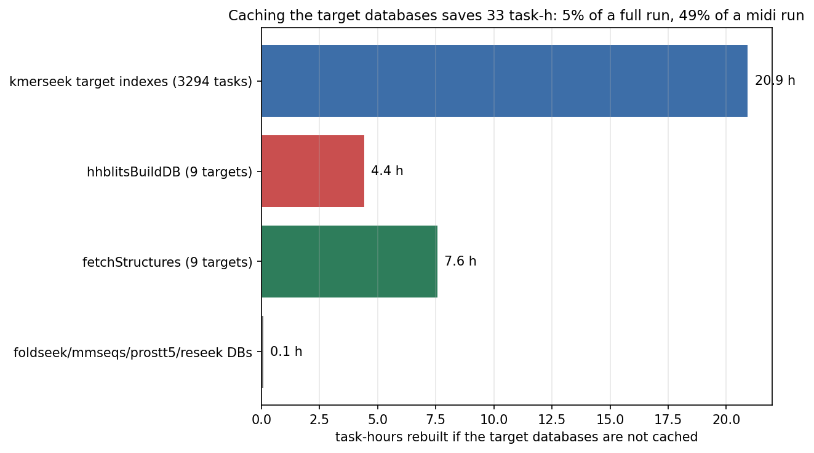
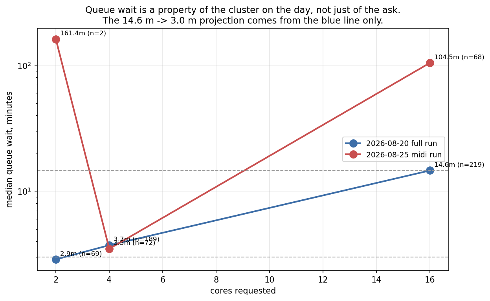

# QfO Pfam region benchmark: runtime and resource report

Built from Nextflow trace files. `main.nf` and `nextflow.config` were read only for task
counts, the alphabet/ksize table and the core allocations. No pipeline code was changed.

Traces used:

| trace | rows | completed | wall h | queue h | run h | in-flight | running | peak running |
|---|---|---|---|---|---|---|---|---|
| `/tmp/qfo_pfam_region.2026-08-20.trace.txt` (full/maxi) | 618 | 477 | 3.24 | 117.5 | 98.3 | 66.7 | 31.2 | 54 |
| `/tmp/qfo-traces/run-midi/qfo_pfam_region.2026-08-25.trace.txt` (midi) | 142 | 142 | 5.35 | 162.2 | 7.0 | 31.6 | 1.4 | 14 |

Also read: `/tmp/qfo-traces/qfo_pfam_region.2026-08-19.trace.txt` (10 `fetchStructures`
tasks), `/tmp/qfo-traces/run/qfo_pfam_region.2026-08-25.trace.txt` and the two
`run-mini` traces (small per-target DB builds).

`in-flight` is sum(queue + run) / wall, the occupancy that Nextflow's `executor.queueSize`
caps at 100. `running` is the time-averaged count of concurrently running tasks. Both are
measured.

## 1. Wall-clock ETAs

### The queue model

Every task is one SLURM job on `hns`. A job holds a slot in Nextflow's submission pipeline
for its whole life, queue wait plus runtime, so with C jobs in flight

```
wall clock  =  sum over all tasks of (queue wait + runtime)  /  C
```

C measured on the 2026-08-20 run was 66.7. Central case C = 67, band C = 40 (busier
cluster) to C = 100 (the `queueSize` cap).

Queue-wait bands, measured on that same run:

| cores requested | n | median wait |
|---|---|---|
| 2 | 69 | 2.9 m |
| 4 | 189 | 3.7 m |
| 16 | 219 | 14.6 m |

Cores drive the wait, not memory: 32 GB asks waited 3.7 m and 96 GB asks 2.9 m, while the
64 GB asks that all happened to be 16-core waited 14.6 m.

### MIDI run

964 human queries against the nine full target proteomes.

| ETA | value | assumption |
|---|---|---|
| central | **12.0 h** | C = 67 in flight, kmerseek at its modeled central cost |
| range | **7.4 - 25.1 h** | low = kmerseek/2.21 at C = 100; high = kmerseek x2.21 at C = 40 |

Task-life budget, 806 h over 13_742 tasks. The five largest terms:

| process | n | queue wait | per-task runtime | task-life h |
|---|---|---|---|---|
| scoreDomainCalls | 10_098 | 3.0 m | 0.02 m | 508.9 |
| kmerseekIndexAndSearch | 3294 | 3.0 m | 0.73 m | 204.7 |
| folddiscoQuery | 180 | 14.6 m | 1.18 m | 47.4 |
| fetchStructures | 10 | 3.0 m | 54.80 m | 9.6 |
| hhblitsBuildDB | 10 | 14.6 m | 27.42 m | 7.0 |

739 of those 806 task-hours, 92%, are queue wait on tasks that do almost no work.
`scoreDomainCalls` runs 10_098 times for a few seconds each and pays 3 minutes of queue
wait every time: 505 of its 509 task-hours are waiting. A midi run is a scheduling problem,
not a compute problem.

### FULL / maxi run

19_696 human queries, same nine targets.

| ETA | value | assumption |
|---|---|---|
| central | **21.5 h** | C = 67 in flight, kmerseek at its modeled central 555 task-h |
| range | **10.5 - 57.7 h** | low = kmerseek/2.21 at C = 100; high = kmerseek x2.21 at C = 40 |

Task-life budget, 1440 h over 13_742 tasks, split 739 h queued against 700 h running:

| process | n | queue wait | per-task runtime | task-life h |
|---|---|---|---|---|
| kmerseekIndexAndSearch | 3294 | 3.0 m | 10.11 m | 719.8 |
| scoreDomainCalls | 10_098 | 3.0 m | 0.30 m | 554.7 |
| folddiscoQuery | 180 | 14.6 m | 15.62 m | 90.7 |
| jackhmmerSearch | 9 | 14.6 m | 165.63 m | 27.0 |
| fetchStructures | 10 | 3.0 m | 54.80 m | 9.6 |
| phmmerSearch | 9 | 14.6 m | 44.32 m | 8.8 |
| hhblitsBuildDB | 10 | 14.6 m | 25.80 m | 6.7 |

### What is measured and what is not

Measured: every queue wait, every runtime quoted for a process that has COMPLETED rows in
the 2026-08-20 trace, the in-flight and running concurrencies, the per-species index floor,
the per-target `hhblitsBuildDB` and `fetchStructures` costs.

Modeled: the 555 task-h kmerseek total, from a fit on 189 observed full-query tasks
covering 4 of the 17 alphabets. `log(seconds) = a_species - 0.5632*bits + 0.00730*bits^2`,
bits = ksize x bits-per-symbol, residual sd 0.79, a x2.21 spread. That spread is the whole
of the ETA band.

Not derivable from any trace, and therefore either excluded or carried at a value that is
known to be wrong:

- `folddiscoIndex` has no COMPLETED row anywhere. Excluded from both ETAs.
- `prostt5Search` and `reseekSearch` have no COMPLETED row at full query scale. The
  midi/mini values are used, which understates the full run.
- `prostt5Db` at full proteome scale is unmeasured; the 8-36 s mini numbers will not hold.
- `scoreDomainCalls` was only ever measured against yeast, the second-smallest proteome,
  and only for protein/dayhoff. Section 5 below explains how it was scaled.

### Where the extrapolation is weakest: the protein20 bias

All 72 completed midi kmerseek tasks are `protein20` at k = 5-9. That is the cheapest
alphabet family in the sweep, so `3294 x midi mean` is biased low. Quantified by comparing
the model's mean over the whole 3294-task sweep against its mean over exactly the 72
combos midi ran, both under the same midi transform:

| assumption | mean over the 72 midi combos | mean over all 3294 | bias | naive 35 task-h corrects to |
|---|---|---|---|---|
| Q_eff = 20.4 | 0.67 m | 0.86 m | x1.28 | 44 task-h |
| Q_eff = 43.9 | 0.52 m | 0.60 m | x1.17 | 41 task-h |

The bias is 1.2-1.3x, not the 5-10x one might expect, for two reasons. At midi scale
kmerseek is index-bound: 21 of the roughly 47 midi kmerseek task-hours is index building,
and the index does not care which alphabet it is. And `protein20` at k = 5 sits at 20.9
keyspace bits, the same band as the HP alphabets at k = 18-21, so midi did sample the
expensive low-bits corner even while only sampling one alphabet.

Adopted midi kmerseek figure: 40 task-h central, band 26 - 79. The index component is
measured; only the search component carries the x2.21 spread.

Three independent routes to that number:

| route | task-h | mean m/task |
|---|---|---|
| model, Q_eff = 20.4 (query-proportional) | 47.1 | 0.86 |
| model, Q_eff = 43.9 (measured median) | 33.1 | 0.60 |
| naive: 3294 x observed midi mean | 34.8 | 0.63 |



## 2. The same ETAs after the nextflow.config resource change

Changed: `folddiscoQuery` 16 -> 4 cores / 16 GB, `hhblitsSearch` 16 -> 2 / 8 GB,
`hhblitsBuildDB` 16 -> 8 / 16 GB, `phmmerSearch` 16 -> 8, `jackhmmerSearch` 16 -> 8,
`domainIdentity` 16 -> 8 / 16 GB.

Modeled as those processes moving from the 14.6 m queue-wait band to the 3.0 m band. This
is a projection from two observed wait bands, not a measurement. In particular no 8-core
job has ever run in these traces, so the 8-core wait is assumed rather than known.
`domainIdentity` is the one process whose runtime is also adjusted: it kept 13.9 of its 16
cores busy, so at 8 cores its 0.63 m becomes 1.10 m.

| run | before | after | saving at C = 67 |
|---|---|---|---|
| midi | 12.0 h | 11.4 h | 0.7 h, 5% |
| full | 21.5 h | 20.8 h | 0.7 h, 3% |

Task-life drops 806 -> 763 h (midi) and 1440 -> 1396 h (full). At the other two
concurrencies: midi 20.2 -> 19.1 h at C = 40 and 8.1 -> 7.6 h at C = 100; full 36.0 -> 34.9
h at C = 40 and 14.4 -> 14.0 h at C = 100.

Sensitivity: if an 8-core ask actually waits 7.4 m (log-interpolated between the measured
4-core 3.7 m and 16-core 14.6 m) rather than 3.0 m, the after-ETAs become 11.4 h and 20.9 h.
The assumption barely matters, because only four processes with 9-10 tasks each sit at 8
cores.

The wall clock barely moves because neither of the two processes that dominate this
pipeline was touched. `kmerseekIndexAndSearch` was already at 4 cores and
`scoreDomainCalls` at 2, and between them they are 89% of the full run's task-life.
`folddiscoQuery` is the one change that pays: 180 tasks x 11.6 m less wait = 35 task-hours.

What the change does buy is cluster footprint. Core-hours reserved on `hns` for a full run:

| process | n | cores before | core-h before | cores after | core-h after |
|---|---|---|---|---|---|
| kmerseekIndexAndSearch | 3294 | 4 | 2220.5 | 4 | 2220.5 |
| folddiscoQuery | 180 | 16 | 749.6 | 4 | 187.4 |
| jackhmmerSearch | 9 | 16 | 397.5 | 8 | 198.8 |
| phmmerSearch | 9 | 16 | 106.4 | 8 | 53.2 |
| scoreDomainCalls | 10_098 | 2 | 99.6 | 2 | 99.6 |
| hhblitsBuildDB | 10 | 16 | 68.8 | 8 | 34.4 |
| **total** | | | **3718.5** | | **2868.4** |

3719 -> 2868 core-hours, 23% smaller. If C rose in proportion to the freed cores (C = 87),
the after-ETAs would be 8.8 h (midi) and 16.1 h (full). That is the optimistic bound; the
traces cannot confirm it, since C is set by SLURM's scheduling, not by this pipeline.



## 3. Savings from caching the target databases

Every artefact below is built from a target proteome or its structures. The human query
set differs between midi and full; the targets do not, so all of it can be built once.

| cacheable per-target artefact | task-h | source |
|---|---|---|
| kmerseek target indexes (3294 tasks) | 20.9 | measured per-species floor x sweep |
| hhblitsBuildDB (9 targets) | 4.4 | measured |
| fetchStructures (9 targets) | 7.6 | measured |
| foldseekDb / mmseqsDb / mmseqsDomainDb / prostt5Db / reseekConvert | 0.1 | mini-scale floor |
| **total** | **33.0** | |

Against a full run of 700 task-h of compute that is **5%**. Against a midi run of 67
task-h it is **49%**: caching the targets roughly halves the compute of a midi run. At
C = 67 in flight it is 0.5 h of wall clock, which is the honest framing. The saving is
real in core-hours and small in wall clock, because this pipeline is queue-bound rather
than compute-bound.

The midi run of 2026-08-25 did in fact rebuild 6 of the 9 `hhblitsBuildDB` target
databases from scratch, 2.92 task-h, so the cache did not carry across those two runs.

Per-target detail:

| species | FASTA MB | kmerseek index m | hhblitsBuildDB m | fetchStructures m |
|---|---|---|---|---|
| ecoli | 1.8 | 0.09 | 8.20 | 11.27 |
| yeast | 3.7 | 0.14 | 7.92 | 17.07 |
| ciona | 7.7 | 0.25 | 38.08 | 65.75 |
| fly | 8.7 | 0.36 | 17.27 | 42.75 |
| worm | 10.0 | 0.38 | 25.80 | 54.80 |
| chicken | 11.7 | 0.49 | 22.37 | 38.62 |
| mouse | 13.6 | 0.53 | 51.57 | 61.10 |
| arabidopsis | 14.2 | 0.54 | 36.45 | 76.90 |
| zebrafish | 16.7 | 0.65 | 57.80 | 85.37 |

The kmerseek index cost is linear in proteome size at 0.04 m/MB with r^2 = 0.99.
`hhblitsBuildDB` is 3.09 m/MB, r^2 = 0.72, and `fetchStructures` 4.53 m/MB, r^2 = 0.77,
both noisier because they are respectively HMM-building and network-bound.

Not counted, because they are not derivable from any trace: `folddiscoIndex` (no COMPLETED
row) and `prostt5Db` at real proteome scale (only mini rows exist). Both are per-target and
both would add to the saving.





## 4. Two things the traces contradict or complicate

**Queue wait is a property of the cluster on the day, not of the ask alone.** The
14.6 m / 3.0 m bands come from the 2026-08-20 run. On 2026-08-25 the same 16-core ask waited
104.5 m (n = 68) and the same 4-core ask waited 3.5 m (n = 72). The direction holds; the
magnitude is 7x worse. The 96% queue share of the midi run's task-life is that day's
cluster load, not a property of midi. Every projection in section 2 inherits this, and it
is the largest single uncertainty in the ETAs after the kmerseek model.



**The full run is slower per query than midi, not faster.** On the three combos measured at
both scales the raw ratios are 17.6x, 27.3x and 29.9x against a query ratio of 20.4x.
Subtracting the measured index floor gives an effective query ratio of 22.6, 43.9 and 45.9.
A pure index-plus-linear-search model predicts exactly 20.4. Something is superlinear in
query count, or the full run's higher concurrency cost it I/O. n = 3, all `protein20` k = 5,
so this is suggestive rather than settled, but it means the query-proportional 20.4x is the
conservative end for midi and not the expected value.

## 5. scoreDomainCalls, the second-largest term

`scoreDomainCalls` runs 10_098 times: 3 truth sets (pfam, pfamn, swissprot) x roughly 3366
region tables. Every COMPLETED row in the 2026-08-20 trace scored a yeast result, and only
protein/dayhoff, ranging 1.4 s to 31.3 s with a 3.8 s median. Scoring time tracks the size
of the region table, which tracks keyspace bits the same way kmerseek runtime does:

```
log(score seconds) = 2.995 - 0.0402 * keyspace bits     r^2 = 0.42, n = 50
```

Extrapolated to the other species by multiplying by (target FASTA MB / 3.7 MB), a linear
assumption that is not verified. That gives 50 task-h for a full run and 4.0 task-h for
midi, against 10.7 task-h for a flat 3.8 s median. This is the weakest number in the report
after the kmerseek model, and it barely moves either ETA: `scoreDomainCalls` is dominated by
10_098 x 3.0 m = 505 task-h of queue wait, not by its runtime. Cutting the number of
scoring jobs, or batching them, is worth more than making each one faster.

## Figures

- `qfo_eta_before_after_resource_change.png` — ETA breakdown before vs after, plus the core-hour footprint
- `qfo_index_cost_vs_proteome_size.png` — kmerseek index, hhblitsBuildDB and fetchStructures against proteome size
- `qfo_midi_vs_full_task_time.png` — midi vs full per-task time and the protein20 bias
- `qfo_queue_wait_by_cores.png` — queue wait by cores requested, both runs
- `qfo_target_db_cache_savings.png` — cacheable per-target work
